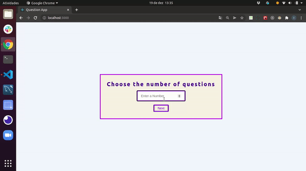

<div align="center" id="top"> 
  &#xa0;
</div>

<h1>Desafio Técnico  Wa</h1>

<p align="center">
  
</p>


## :rocket: Technologies ##

- [ReactJS](https://pt-br.reactjs.org/)
- [Javascript](https://developer.mozilla.org/pt-BR/docs/Web/JavaScript)
- [React-Router-Dom](https://reactrouter.com)
- [CSS3](https://www.w3schools.com/css/)
- [Formik](https://formik.org/docs/overview)
- [Style-Components](https://styled-components.com/)
- [Yup](https://www.npmjs.com/package/yup)

## :checkered_flag: Starting ##

```bash
# Clone this project
$ git clone https://github.com/

# Access
$ cd WA-GAMER

# Install dependencies
$ yarn / npm install

# Run the project
$ yarn start / npm start

# The server will initialize in the <http://localhost:3000>
```

## Project Structure

```
src/
 |--- _test/        # Arquivos de testss
 |--- components/   # Componentes
 |--- pages/        # Páginas
 |--- context/      # Arquivo contendo o estado global do App
 |--- hook/         # Arquivo contendo  o acesso para escrita e leitura do estado global
 |--- paths/        # Arquivo contendo o endereço das rotas do App
 |--- services/     # Arquivo contendo as requisições feitas apara a API
 |--- styles/       # Arquivo contendo a estilização do App
 |--- utils/        # Arquivo contendo funções utilizadas em alguns locais do App
 |--- App.js        # Arquivo com configurações principais do App
 |--- index.js      # Ponto de entrada para execução do nosso App
```

## Logbook

### Criando a aplicação com create-react-app

--> A criação de aplicações em React do zero, com as configurações do Webpack e do Babel e de todo o ambiente de desenvolvimento é bem interessante, pois deixa o ambiente customizável de acordo com as necessidades do seu projeto. Mas em alguns casos, o create-react-app facilita muito a vida por trazer boa parte dessas definições previamente configuradas. Portanto, utilizamos o seguinte comando para a criação da aplicação:

```
$ yarn / npm create react-app  frontsiteongpaisafetivos
```

### Styled-components

--> A escolha do styled-components vem pela facilidade de customização de estilo através da criação de componentes estilizados utilizando javascript, é um recurso super interessante e poderoso, já que reduz o uso de classes e id's para determinação de estilos, problemas de acesso aos arquivos CSS e torna a legibilidade do código muito mais fácil de interpretar.
--> Uma das vantagens da utilização do styled-components é que, assim como o sass, também permite o uso do encadeamento, ou seja, caso um elemento possua um outro elemento como filho, é possível realizar a estilização do mesmo dentro da estilização desse componente.
--> Outra vantagem é a utilização da estilização limitada ao escopo em que o componente estilizado foi criado. Ele acaba gerando uma classe com uma chave única para que a estilização daquele componente não interfira no restante da aplicação.


### Formik
--> Formik mantém o controle do estado do formulário e, em seguida, expõe mais alguns métodos reutilizáveis e manipuladores de eventos ( handleChange, handleBlure handleSubmit) para o formulário via props. handleChangee handleBlurfuncionam exatamente como o esperado - eles usam um atributo name ou id para descobrir qual campo atualizar.

### Yup

--> Yup é um construtor de esquema JavaScript para análise e validação de valor. Defina um esquema, transforme um valor para corresponder, valide a forma de um valor existente ou ambos. Os esquemas Yup são extremamente expressivos e permitem modelar validações complexas e interdependentes ou transformações de valor.
--> A API do Yup é fortemente inspirada no Joi , mas é mais enxuta e construída com a validação do lado do cliente como seu caso de uso principal. Yup separa as funções de análise e validação em etapas separadas. cast()transforma os dados enquanto validateverifica se a entrada tem a forma correta. Cada um pode ser executado em conjunto (como validação de formulário HTML) ou separadamente (como desserializar dados confiáveis ​​de APIs).